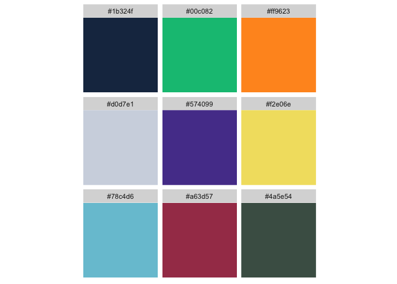
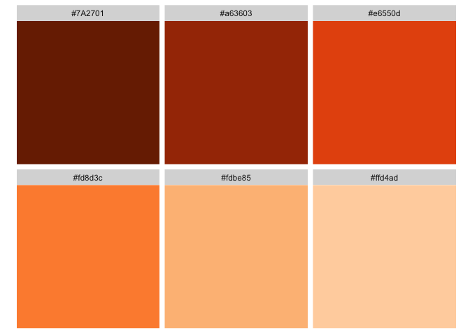
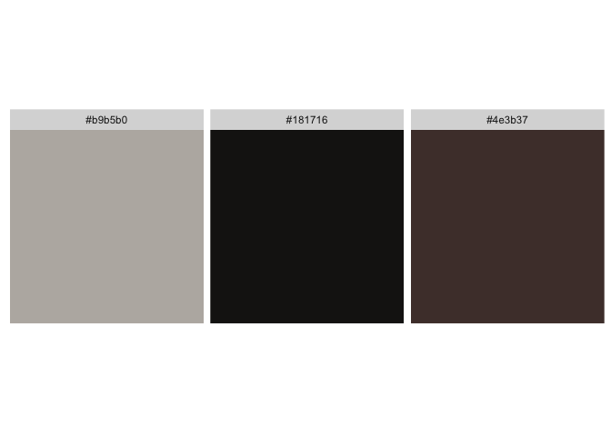
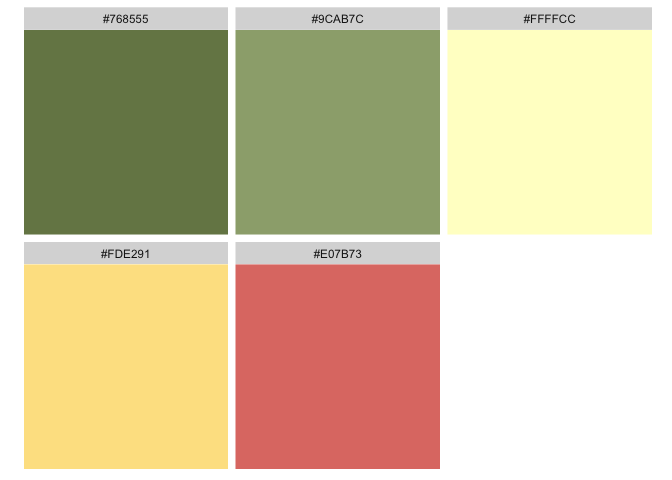

<!-- README.md is generated from README.Rmd. Please edit that file -->

# r2dii.colours <a href='https://github.com/2DegreesInvesting/r2dii.colours'></a>

<!-- badges: start -->

[](https://lifecycle.r-lib.org/articles/stages.html)
[](https://app.codecov.io/gh/2DegreesInvesting/r2dii.colours?branch=master)
[](https://github.com/2DegreesInvesting/r2dii.colours/actions)
[](https://CRAN.R-project.org/package=r2dii.colours)
<!-- badges: end -->

The goal of `r2dii.colours` is to provide you with an easy access to
colours from palettes created for different research streams within
2DII.

## Installation

You can install the development version from GitHub with:

``` r
# install.packages("devtools")
devtools::install_github("2DegreesInvesting/r2dii.colours")
```

## Examples

The `r2dii.colours` package can be used to retrieve 2DII colour palettes
or to retieve the hex codes of particular colours from a palette.

``` r
library(munsell)
library(ggplot2)
library(r2dii.colours)
```

For example, you can retrieve the 2DII plots colour palette and use it’s
‘hex’ column to define the values of the ‘colour’ aesthetic of your
ggplot (the first two colours in the palette are used as line colours in
this case).

``` r
# The palette dataset
palette_2dii_plot
#> # A tibble: 9 × 2
#>   label       hex    
#>   <chr>       <chr>  
#> 1 dark_blue   #1b324f
#> 2 green       #00c082
#> 3 orange      #ff9623
#> 4 grey        #d0d7e1
#> 5 dark_purple #574099
#> 6 yellow      #f2e06e
#> 7 soft_blue   #78c4d6
#> 8 ruby_red    #a63d57
#> 9 moss_green  #4a5e54

# Use dataset in your plot
df2 <- data.frame(supp=rep(c("VC", "OJ"), each=3),
                dose=rep(c("D0.5", "D1", "D2"),2),
                len=c(6.8, 15, 33, 4.2, 10, 29.5))

ggplot(df2, aes(x = dose, y = len, group = supp, colour = supp)) + 
  geom_line() +
  scale_colour_manual(values = palette_2dii_plot$hex)
```


Or you can retrieve the hex codes from a particular palette using the
`get_colours` function and use only these specific colours (in the
specific order) in your plot.

``` r
# Retrieve the colours in chosen order
colours <- get_colours(
  colour_names = c("green", "grey", "red"), 
  palette = palette_1in1000_goodbad
  )

# Use colours in your plot
ggplot(mtcars, aes(x = wt, y = mpg, colour = factor(cyl))) + 
  geom_point() +
  scale_colour_manual(values = colours)
```


## Available colour palettes

The colour palettes available in `r2dii.colours` package are displayed
below using `munsell` package for convenient hex code colour display.
For the colour labels please investigate the palette datasets as shown
in the example above.

### 2DII palettes

Extended organization colour palette that can be used for plotting.

``` r
munsell::plot_hex(palette_2dii_plot$hex)
```



Sector colours (aligned with the [PACTA interactive
report](https://2degreesinvesting.github.io/SampleReports/SampleGeneralReport/index.html)).

``` r
munsell::plot_hex(palette_2dii_sector$hex)
```


Automotive sector technologies colour shades.

``` r
munsell::plot_hex(palette_2dii_automotive$hex)
```


Power sector technologies colour shades.

``` r
munsell::plot_hex(palette_2dii_power$hex)
```



Oil & gas sector technologies colour shades.

``` r
munsell::plot_hex(palette_2dii_oil_gas$hex)
```


Fossil fuels sector technologies colour shades.

``` r
munsell::plot_hex(palette_2dii_fossil_fuels$hex)
```



Scenario colours.

``` r
munsell::plot_hex(palette_2dii_scenario$hex)
```



### 1 in 1000 research stream palettes

Extended colour palette that can be used for plotting.

``` r
munsell::plot_hex(palette_1in1000_plot$hex)
```


Colour palette that can be used for differentiating between ‘good’,
‘bad’ and ‘neutral’ outcomes.

``` r
munsell::plot_hex(palette_1in1000_goodbad$hex)
```


Official background colour.

``` r
munsell::plot_hex(palette_1in1000_background)
```


