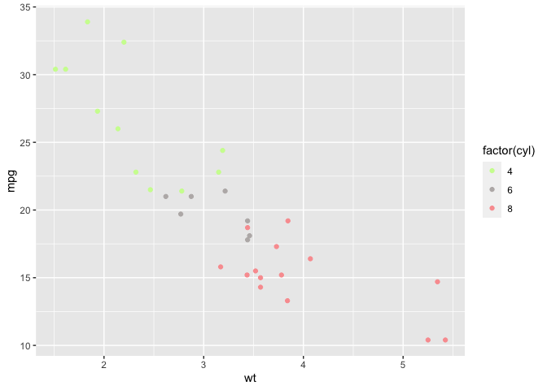

<!-- README.md is generated from README.Rmd. Please edit that file -->

# r2dii.colours <a href='https://github.com/2DegreesInvesting/r2dii.colours'></a>

<!-- badges: start -->

[](https://lifecycle.r-lib.org/articles/stages.html)
[](https://app.codecov.io/gh/2DegreesInvesting/r2dii.colours?branch=master)
[](https://github.com/2DegreesInvesting/r2dii.colours/actions)
[](https://CRAN.R-project.org/package=r2dii.colours)
<!-- badges: end -->

The goal of r2dii.colours is to provide you with an easy access to
colours from palettes created for different research streams at 2DII.

## Installation

You can install the development version from GitHub with:

``` r
# install.packages("devtools")
devtools::install_github("2DegreesInvesting/r2dii.colours")
```

## Examples

The r2dii.plot package can be used to retrieve datasets containing 2DII
colour palettes or to get hex codes of particular colours from a
palette.

``` r
library(munsell)
library(ggplot2)
library(r2dii.colours)
```

For example, one can retrieve the colour palette dataset defined for
plots in 1 in 1000 research stream.

``` r
palette <- palette_1in1000_plot
palette
#> # A tibble: 10 × 2
#>    label  hex    
#>    <chr>  <chr>  
#>  1 black  #000000
#>  2 white  #FFFFFF
#>  3 red    #F53D3F
#>  4 blue   #3d9bf5
#>  5 green  #5D9324
#>  6 yellow #f5f33d
#>  7 violet #973df5
#>  8 orange #f5973d
#>  9 pink   #f53d9b
#> 10 grey   #BAB6B5

munsell::plot_hex(palette$hex)
```


Or one can retrieve the hex codes from a particular palette and use them
in their plots.

``` r
colours <- get_colours(
  c("green", "grey", "red"), 
  palette = palette_1in1000_goodbad
  )

ggplot(mtcars, aes(x = wt, y = mpg, colour = factor(cyl))) + 
  geom_point() +
  scale_colour_manual(values = colours)
```


